# API Manager

[English](README.md) · **简体中文** · [繁體中文](README.tc.md)

[](https://github.com/freewu/api-manager/releases)
[](LICENSE)
[](https://github.com/freewu/api-manager/releases)
[](#下载)

[](https://tauri.app)
[](https://www.rust-lang.org)
[](https://react.dev)
[](https://www.typescriptlang.org)
[](https://vitejs.dev)

使用 **Tauri 2**（Rust + React）开发的 API 接口文档、接口测试与 Mock 工具，界面布局参考 Postman。**目录即集合、一个接口一个 JSON 文件**，接口定义可以随代码一起提交到 Git，便于评审、追溯与团队协作。

> 🌍 三语界面（简体中文 / 繁體中文 / English） · 🖥️ Windows / macOS / Linux · 📦 开源免费（MIT）

## 界面预览

| | |
| --- | --- |
| 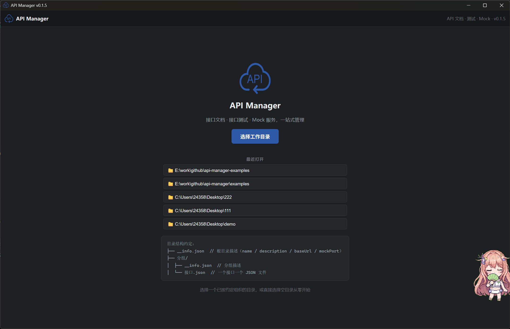 | 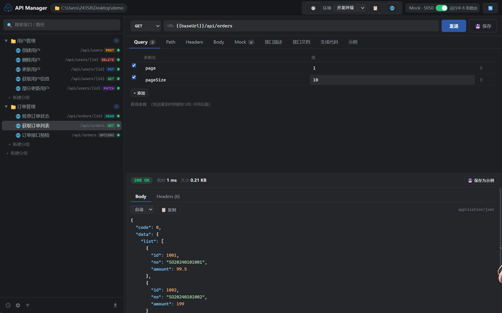 |
|  | 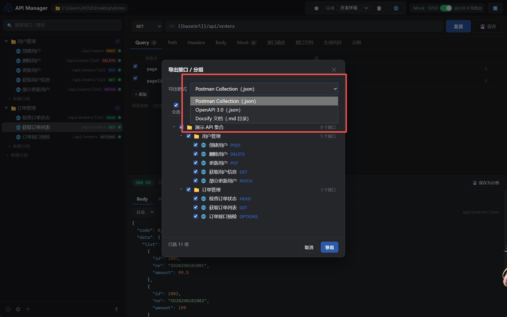 |
| 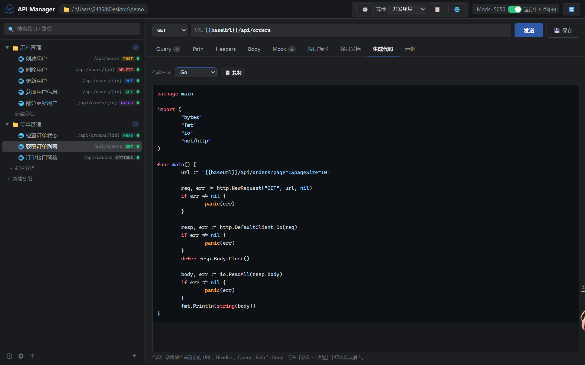 | 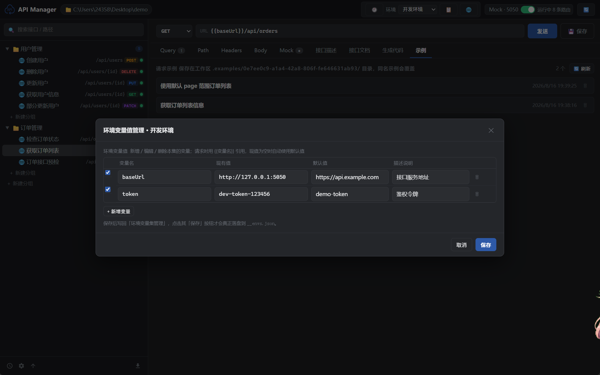 |
| 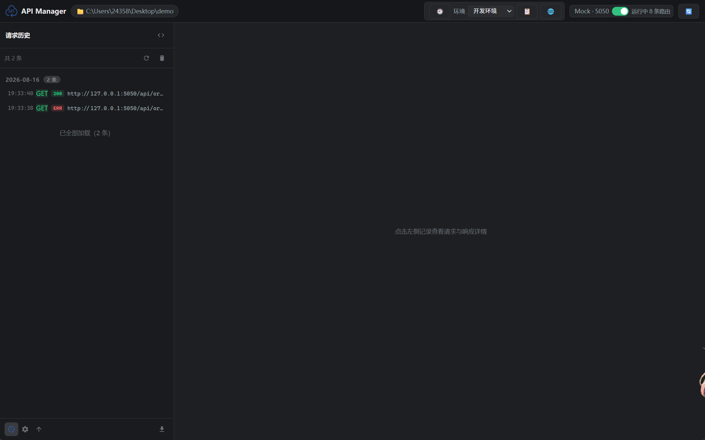 | 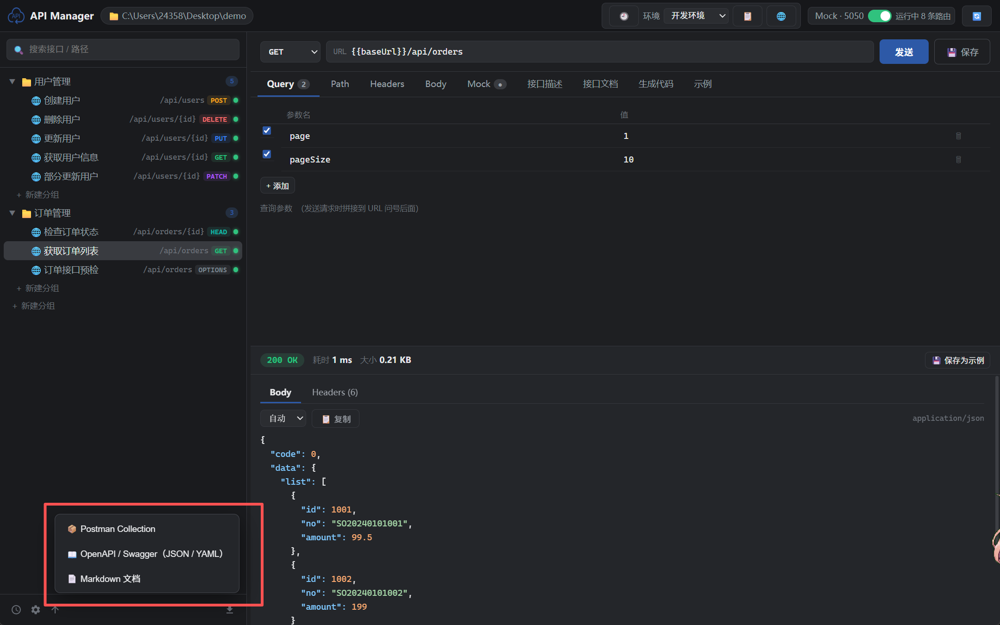 |
| 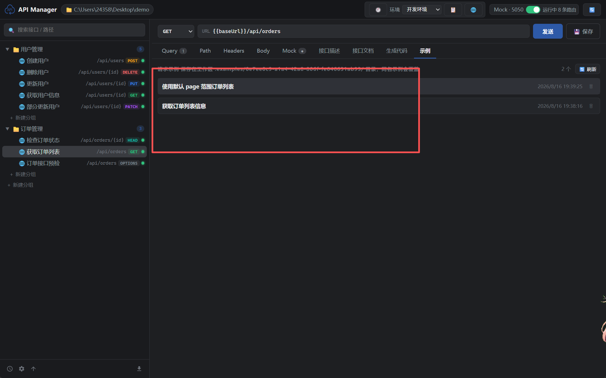 | 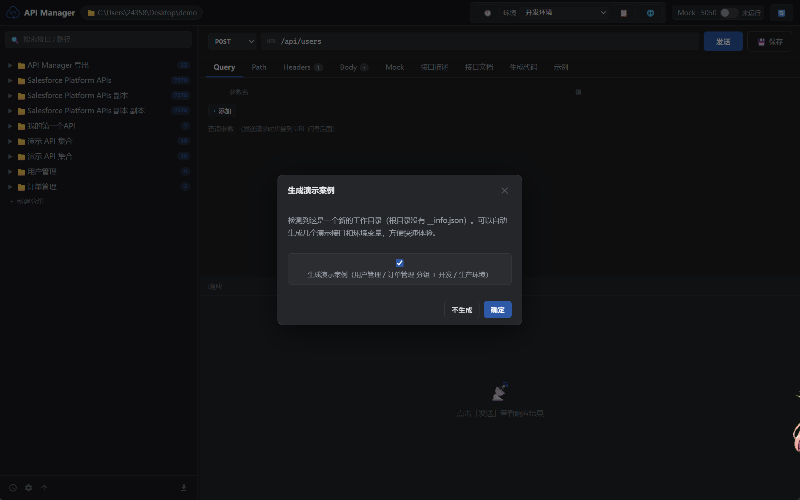 |
| 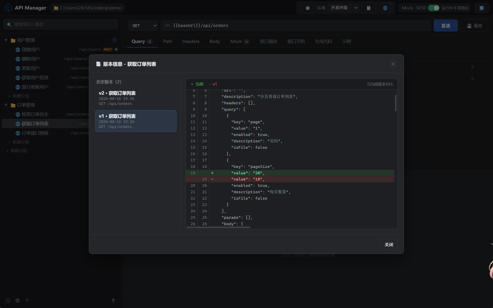 | 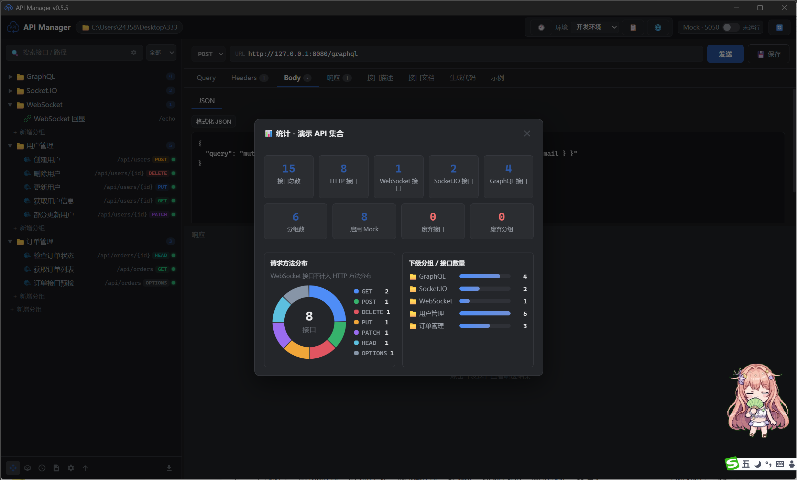 |
| 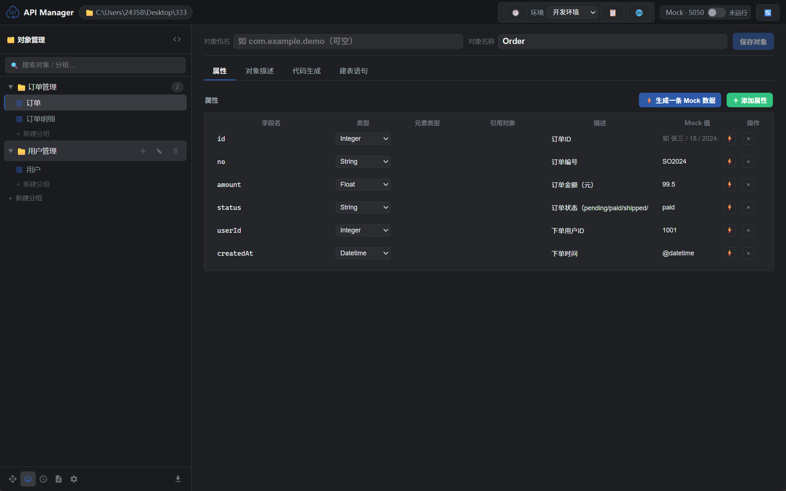 | 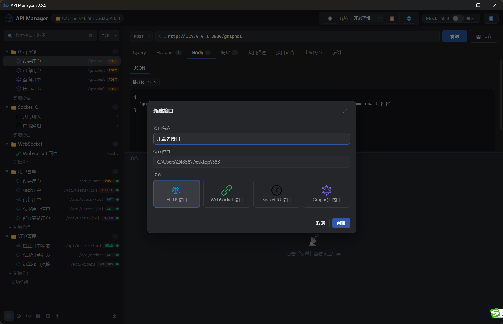 |
| 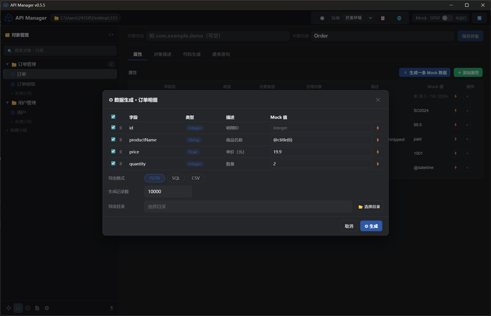 | 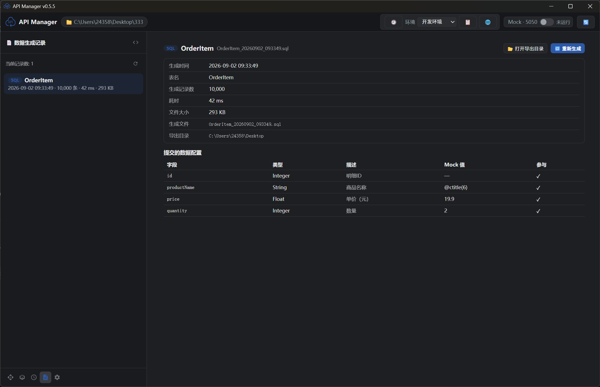 |
| 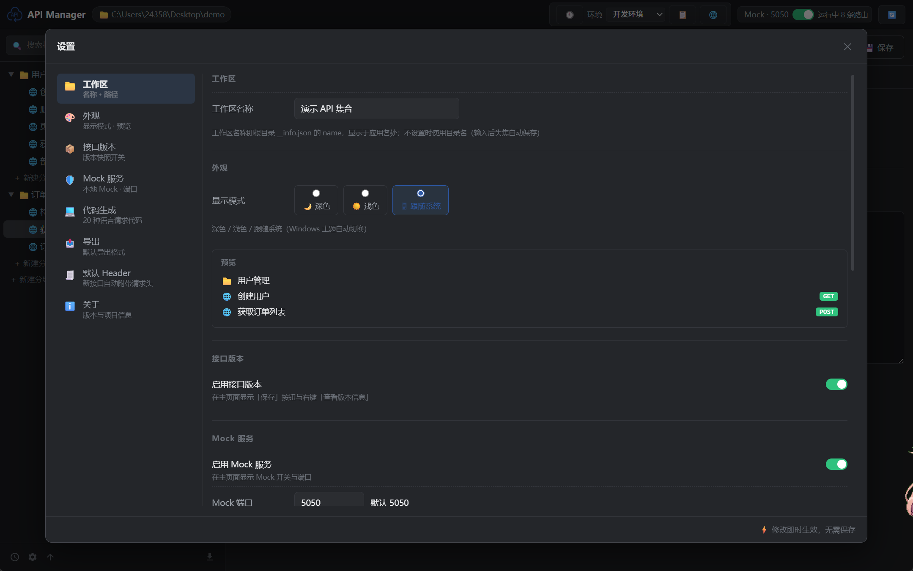 | |

## 功能特性

### 🗂️ 工作区与集合

- 📁 **目录即集合**：打开应用时选择一个工作目录，目录结构就是接口集合结构，一个分组对应一个目录
- 📄 **一个接口一个 JSON 文件**：接口定义、请求参数、Mock 数据与请求示例全部以 JSON 文件形式管理，天然支持 Git 版本管理
- 🕘 **版本管理**：每个接口可保存多个版本快照，支持左右对比差异，随时回退到任意历史版本
- 🔀 **版本控制集成**：自动识别工作区中的 `.git` / `.svn`，标题栏提供一键**同步**与**提交并 Push**（远程配置见 *设置 → 同步远程*）
- 🔍 **搜索与高级搜索**：按名称 / 路径快速搜索接口，也可按接口类型与 Method 过滤
- ⭐ **收藏**：接口右键选择「收藏」即可加入收藏视图，支持拖动排序，并拥有独立的编辑面板

### 🧪 接口测试

- 🧪 **发送请求**：支持 GET / POST / PUT / DELETE / PATCH / HEAD / OPTIONS，查看状态码、耗时、大小、Headers 与 Body，JSON 语法高亮、JSON / XML 一键格式化
- 🌐 **路径参数 / Query / Headers / Body** 完整支持（Body 支持 raw / JSON / XML / 表单 / **二进制文件**）
- 🧩 **模板变量**：接口支持 `{参数名}` 路径模板，以及 `{{path.id}}`、`{{query.page}}`、`{{method}}`、`{{path}}`、`{{变量名}}`，在 URL / Headers / Query / Body / Mock 响应中自动替换
- 🕘 **请求历史**：自动记录每一次请求，一键再次发送或回填到编辑器
- 📋 **请求示例**：把请求 + 响应保存为命名示例，可一键应用到当前接口，也可把某个接口的全部示例导出为 `.http` 文件
- ✏️ **批量添加编辑**：Query / Headers / Body（表单）页签支持 `key: value` 每行一条的批量编辑，保存后匹配行保留启用状态

### 🔌 多协议接口

- 🔌 新建接口支持 **HTTP / WebSocket / Socket.IO / GraphQL / WebDAV / MCP / TCP / UDP**，一套工作区、一棵接口树、一份历史记录统一管理
- 🔁 **WebSocket / Socket.IO**：连接后实时收发消息，并在响应区查看帧 / 事件日志
- 🧮 **GraphQL**：查询语句 + 变量编辑器
- 🗂️ **WebDAV**：在标准 HTTP 方法之外提供 `PROPFIND` / `PROPPATCH` / `MKCOL` / `COPY` / `MOVE` / `LOCK` / `UNLOCK` / `REPORT` 等 WebDAV 方法
- 🤖 **MCP**：以 HTTP 方式调用 MCP 端点，复用同一套请求编辑器与响应查看器
- 📦 **TCP / UDP**：报文编辑器自定义字段（名称 / 类型 / 长度 / 值），并内置报文解析查看器

### 🎭 Mock 服务

- 🎭 **一键启动本地 Mock 服务**（默认端口 5050）：自动扫描所有启用 Mock 的接口并对外提供本地服务
- ⚙️ **按接口配置**：状态码、响应 Header、延迟时间与模板响应体
- 🧩 **模板支持**：按请求实时替换 `{{path.id}}` / `{{query.page}}` / `{{method}}` / `{{path}}` 与全局 `{{变量名}}`
- 🚀 **无需后端**：真实接口就绪前，前端开发即可并行推进

### 📝 接口文档、导入与导出

- 📝 **接口文档**：内置接口文档页，自动从请求配置与 Mock 响应体推导参数（类型、嵌套字段、说明），支持手动补充与修正，可导出 Markdown 文档
- ✍️ **Markdown 接口描述编辑器（Vditor）**：接口「描述」页签是完整的 Markdown 编辑器，支持所见即所得与高亮只读预览；**Vditor 全部资源已本地化打包，完全离线可用**
- 🏷️ **apiDoc 注释**：查看接口的 apiDoc 注释，并支持工作区内 Markdown 文档预览
- 📤 **一键导出（28 种格式）**：Postman Collection、**OpenAPI 3.0（JSON 与 YAML，默认 YAML）**、Apifox、Apipost、Apizza、Bruno、Insomnia、Hoppscotch、YApi、Eolink、NEI、Doclever、EasyDoc、Docway、io-docs、MeterSphere、Rap2、JMeter、apiDoc、Apidog、RAML、WADL、HAR，以及文档站点（Docsify / MkDocs / Markdown / HTML）
- 📥 **多格式导入（26 种格式）**：Postman Collection、OpenAPI / Swagger（JSON 与 YAML）、Markdown、Apifox、Apipost、cURL 等；导入菜单展示哪些入口可在 *设置 → 导入* 中配置
- 🔄 **集合变量自动迁移**：导入 Postman Collection 时，文件顶层的 `variable` 数组会按 key 合并到同名环境变量集

### 📦 对象管理与数据生成

- 📦 **对象管理**：以分组 + 对象的方式管理数据结构；属性支持类型 / 引用对象 / Mock 值 / 描述配置；支持从 JSON 或 SQL 建表语句导入；一键生成多语言代码与 MySQL 建表语句
- 🎲 **数据生成**：按对象属性批量生成测试数据（JSON / SQL / CSV），自定义表名、记录数与导出目录
- 🧾 **生成记录**：每次生成记录耗时与文件大小，可一键重新生成
- 🧬 **代码生成**：一键生成 20+ 种语言 / 框架的请求代码（curl、JavaScript、Python、Java、Go、Rust 等）

### ⚙️ 效率与外观

- 🌐 **全局环境变量**：开发 / 测试 / 生产多环境一键切换，`{{变量名}}` 自动替换到 URL / Headers / Query / Body / Mock 响应（详见[全局环境变量](#全局环境变量)）
- ⌨️ **全局快捷键**：9 个可自定义快捷键，覆盖视图切换、导入导出、设置与环境管理（详见[快捷键](#快捷键)），在 *设置 → 快捷键* 中录制新按键
- 🗂️ **Postman 风格布局**：左侧接口树（搜索、分组、增删改、复制）、中间请求编辑器、下方响应面板，各面板可拖动调整
- 📊 **统计**：分组 / 工作区维度统计接口数、Mock 启用数与请求方法分布
- 🖥️ **系统托盘**：关闭窗口最小化到托盘，托盘菜单可显示 / 隐藏窗口、启停 Mock、切换显示模式与语言、检查更新、退出
- 🔔 **检查更新**：启动时自动检查 GitHub Releases，发现新版本弹窗提醒并可一键跳转下载
- ℹ️ **关于页签**：*设置 → 关于* 用 shields.io 徽章展示项目技术栈（Tauri / Rust / React / TypeScript / Vite 等），并汇总应用依赖的全部开源组件（名称、版本、跳转链接）；离线时徽章自动降级为文字标签
- 🎨 **主题**：深色 / 浅色 / 跟随系统，切换即时生效
- 🌍 **三语界面**：简体中文 / 繁體中文 / English，随时切换

## 下载

所有安装包由 GitHub Actions 在每次发布时构建，并发布到 [Releases](https://github.com/freewu/api-manager/releases) 页面。

| 平台 | 安装包 |
| --- | --- |
| Windows | `API.Manager_1.0.0_x64-setup.exe`（NSIS）· `API.Manager_1.0.0_x64_en-US.msi` · `API.Manager_1.0.0_x64_portable.exe`（免安装单体版） |
| macOS | `API.Manager_1.0.0_x64.dmg`（Intel）· `API.Manager_1.0.0_aarch64.dmg`（Apple Silicon） |
| Linux | `API.Manager_1.0.0_amd64.AppImage` · `API.Manager_1.0.0_amd64.deb` · `API.Manager-1.0.0-1.x86_64.rpm` |

> Windows 下也可以自行构建单体可执行文件 `api-manager.exe`，见[开发与构建](#开发与构建)。

## 快捷键

默认快捷键（均可自定义，在 *设置 → 快捷键* 中修改；macOS 请将 <kbd>Ctrl</kbd> 视为 <kbd>Cmd</kbd>）：

| 快捷键 | 功能 |
| --- | --- |
| <kbd>Ctrl</kbd>+<kbd>A</kbd> | 切换到**接口管理**界面 |
| <kbd>Ctrl</kbd>+<kbd>O</kbd> | 切换到**对象管理**界面 |
| <kbd>Ctrl</kbd>+<kbd>H</kbd> | 切换到**请求历史**界面 |
| <kbd>Ctrl</kbd>+<kbd>G</kbd> | 切换到**数据生成记录**界面 |
| <kbd>Ctrl</kbd>+<kbd>F</kbd> | 切换到**收藏**界面 |
| <kbd>Ctrl</kbd>+<kbd>E</kbd> | 打开**导出**弹窗（会先切到接口管理界面） |
| <kbd>Ctrl</kbd>+<kbd>I</kbd> | 打开**导入**菜单（会先切到接口管理界面） |
| <kbd>Ctrl</kbd>+<kbd>S</kbd> | 打开**设置**弹窗（再次按下关闭） |
| <kbd>Ctrl</kbd>+<kbd>M</kbd> | 打开**环境管理**弹窗（再次按下关闭） |

- 在输入框 / 文本域 / 可编辑区域中按键不会触发快捷键；弹窗打开时快捷键不会切换背后的视图
- 录制新快捷键：*设置 → 快捷键* 中点击某一行的按键按钮后按下组合键；<kbd>Esc</kbd> 取消录制，<kbd>Backspace</kbd> / <kbd>Delete</kbd> 清除绑定，`↺` 恢复单行默认值，**全部恢复默认**一键重置
- 存在冲突的绑定会显示 ⚠ 标记，触发时以定义顺序中第一个匹配的动作为准

## 目录结构约定

```
工作目录/
├── __info.json                  # 根目录描述（集合信息）
│                                # 字段：name, description, baseUrl, mockPort
├── __envs.json                  # 全局环境变量（可选）
│                                # 字段：active, environments[{name, variables[]}]
├── 用户管理/                    # 分组 = 目录
│   ├── __info.json              # 分组描述：name, description, order
│   ├── 获取用户信息.json         # 一个接口 = 一个 JSON 文件
│   └── 创建用户.json
└── 订单管理/
    ├── __info.json
    └── 获取订单列表.json
```

### 接口 JSON 文件格式

```json
{
  "name": "获取用户信息",
  "method": "GET",
  "path": "/api/users/{id}",
  "url": "",
  "description": "根据用户 ID 获取用户信息",
  "headers": [{ "key": "Authorization", "value": "Bearer xxx", "enabled": true, "description": "" }],
  "query": [{ "key": "page", "value": "1", "enabled": true, "description": "" }],
  "params": [{ "key": "id", "value": "1001", "enabled": true, "description": "用户 ID" }],
  "body": { "mode": "json", "raw": "{ ... }", "form": [] },
  "mock": {
    "enabled": true,
    "status": 200,
    "headers": [],
    "delay": 200,
    "body": "{ \"code\": 0, \"data\": { \"id\": \"{{path.id}}\" } }"
  },
  "examples": []
}
```

> `url` 为空时，请求地址 = 根 `__info.json` 的 `baseUrl` + `path`；
> 填写 `url` 则优先使用完整地址。

### Mock 模板变量

- `{{path.id}}` — 路径参数（对应 path 中的 `{id}`）
- `{{query.page}}` — Query 参数
- `{{method}}` — 请求方法
- `{{path}}` — 完整路径
- `{{变量名}}` — 全局环境变量（来自激活环境，`path`/`method`/`path.*`/`query.*` 保留给系统变量）

### 全局环境变量

工具栏的**环境**下拉框可快速切换当前环境；点击 🌐 进入环境变量管理，分**两个弹出框**：

**① 环境变量集管理**：新增整套变量配置，支持**拖动排序**；**右键**集名称弹出菜单可 编辑（重命名）/ 复制 / 删除，多套配置（如 开发 / 测试 / 生产）并存；
**② 环境变量值管理**：选中具体的环境变量集后，点击「✏ 管理变量值」打开，维护该集合内的变量（新增 / 编辑 / 删除）。每个变量包含**现有值**、**默认值**（现值为空时自动使用）和**描述说明**。

- 请求发送时，URL / Headers / Query / Body 中的 `{{变量名}}` 会被替换为激活环境的值
- Mock 响应体同样支持 `{{变量名}}`（启动/刷新 Mock 后生效）
- 配置保存在工作区根目录 `__envs.json`，可纳入 Git 管理

示例：`__info.json` 的 `baseUrl` 可设为 `{{baseUrl}}`，在不同环境间切换时请求目标随之变化。

> **Postman 导入**：导入 Collection 时，文件顶层的 `variable` 数组会按 key 合并到同名环境变量集（不存在则新建，命名同集合名；无激活环境时自动激活），无需手动逐个录入。

## 设置一览

*设置*（<kbd>Ctrl</kbd>+<kbd>S</kbd>）共 12 个页签：

| 页签 | 配置内容 |
| --- | --- |
| 📁 工作区 | 工作区名称与路径 |
| 🌐 语言 | 简体中文 / 繁體中文 / English |
| 🎨 外观 | 深色 / 浅色 / 跟随系统，面板预览 |
| 📦 接口版本 | 版本快照开关 |
| 🛡️ Mock 服务 | 本地 Mock 开关与端口 |
| 💻 代码生成 | 请求代码的默认生成语言 |
| 📤 导出 | 默认导出格式，以及导出弹窗中展示的格式 |
| 📥 导入 | 导入菜单中展示的格式 |
| 🧾 默认 Header | 新建接口自动附带的请求头 |
| ⌨️ 快捷键 | 录制 / 重置全局快捷键 |
| 🔄 同步远程 | Git / SVN 远程同步配置 |
| ℹ️ 关于 | 应用版本、项目链接、技术栈徽章与开源组件清单 |

## 系统托盘

- 点击窗口关闭按钮：隐藏到托盘（应用继续运行）
- 托盘图标左键单击：显示窗口；右键：菜单
- 托盘菜单：显示窗口 / 隐藏窗口 / 启动·停止 Mock 服务 / 检查更新 / 显示模式 / 语言（单行子菜单，勾选切换）/ 退出
- 托盘菜单中的 Mock 项文字会随 Mock 服务状态自动更新

## 开发与构建

### 环境要求

- Node.js ≥ 18
- Rust（Windows MSVC 工具链）
- WebView2（Windows 10/11 自带）
- [just](https://github.com/casey/just)（命令运行器）

### 常用命令（[justfile](justfile)）

```bash
just init        # 安装开发环境依赖（Rust 工具链 + Node.js）
just dev         # 开发模式运行（前端热更新 + Rust dev）
just test        # 运行全部测试（Rust 单测 + 前端类型检查 + 前端构建）
just build       # 完整打包：exe + NSIS / MSI 安装程序（可选）
just release     # 仅生成单体可执行文件并收集到 ./release/（无需安装，拷走即用）
just exe         # 仅构建 release 可执行文件（快速，release 的构建部分）
just tsc         # 前端类型检查
just check       # Rust 编译检查
just icon        # 重新生成应用图标（群青主题）
just clean       # 清理构建产物
just push "信息" # 提交并推送到远程
just             # 列出全部命令
```

> justfile 同时支持 Windows（cmd）与 WSL（bash）环境；Windows 命令行下中文参数乱码时，可先执行 `chcp 65001` 切换 UTF-8 代码页。

### 构建产物

- `just release` 产物：`release/api-manager.exe` — 单体可执行文件，无需安装，拷到任意 Windows 机器直接运行（Win10/11 自带 WebView2 运行时）
- `just build`（可选）产物：`src-tauri/target/release/bundle/nsis/API Manager_1.0.0_x64-setup.exe` — NSIS 安装包；`bundle/msi/API Manager_1.0.0_x64_en-US.msi` — MSI

### 运行测试

```bash
just test
```

### 示例工作区

启动应用后选择一个空目录作为工作目录，会提示「生成演示案例」，可一键生成用户管理、订单管理等演示分组与示例接口（内置 Mock 已启用）。

## 技术栈

| 层次 | 技术栈 |
| --- | --- |
| 桌面外壳 | [](https://tauri.app) [](https://www.rust-lang.org) |
| 前端 | [](https://react.dev) [](https://www.typescriptlang.org) [](https://vitejs.dev) |
| 后端（Rust） | [](https://github.com/tokio-rs/axum) [](https://github.com/seanmonstar/reqwest) [](https://tokio.rs) [](https://github.com/tower-rs/tower-http) |
| 数据与协议 | [](https://serde.rs) [](https://github.com/serde-rs/json) [](https://github.com/dtolnay/serde-yaml) [](https://github.com/RazrFalcon/roxmltree) [](https://socket.io) |
| 编辑器与高亮 | [](https://b3log.org/vditor/) [](https://highlightjs.org) |
| 工具链 | [](https://just.systems) [](https://tauri.app) [](https://github.com/tauri-apps/plugins-workspace) [](https://github.com/tauri-apps/plugins-workspace) |

- **主题色**：群青 `#2E59A7`
- 应用内「设置 → 关于」也会列出全部依赖及其声明版本

## 开源许可

[MIT](LICENSE) © bluefrog
