# API Manager

An API documentation, testing, and Mock tool built with **Tauri 2**, with a Postman-inspired layout.

## Screenshots

| | |
| --- | --- |
| 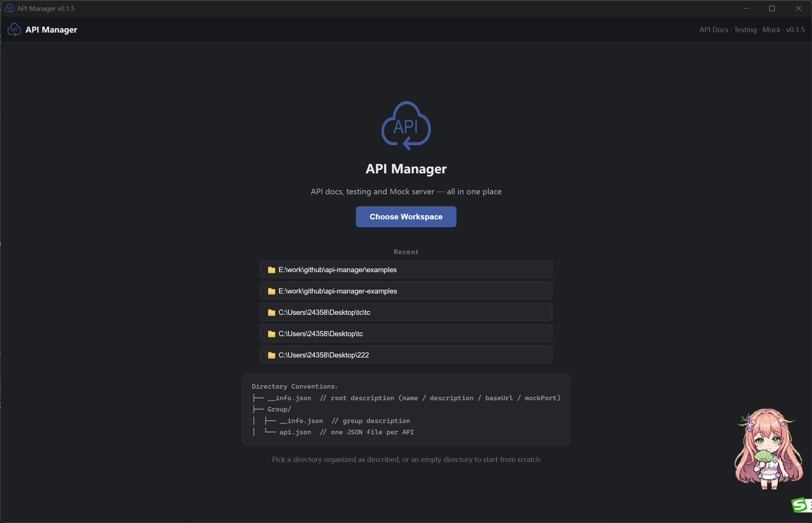 |  |
| 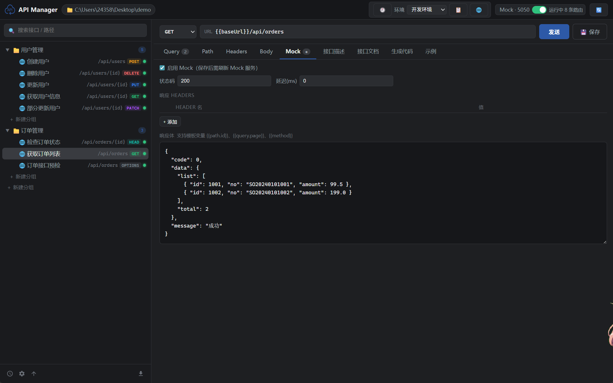 | 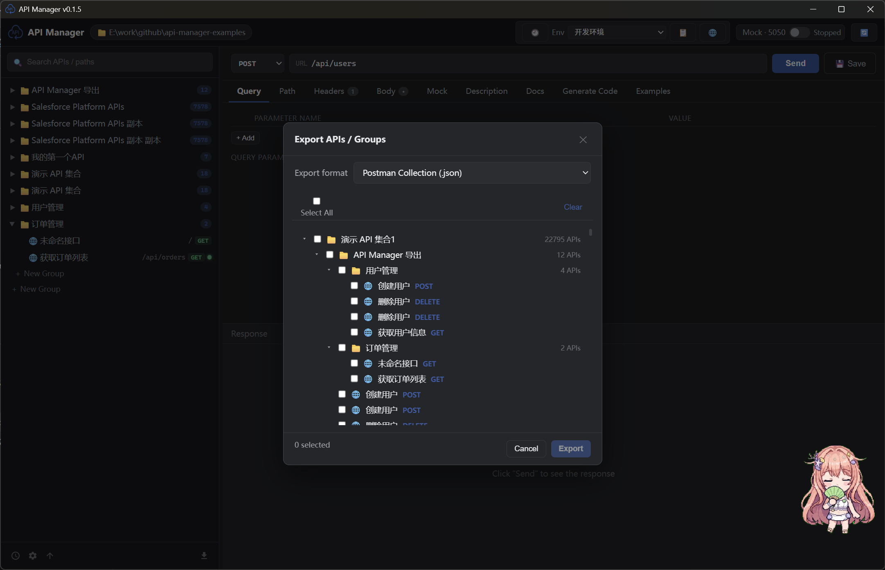 |
| 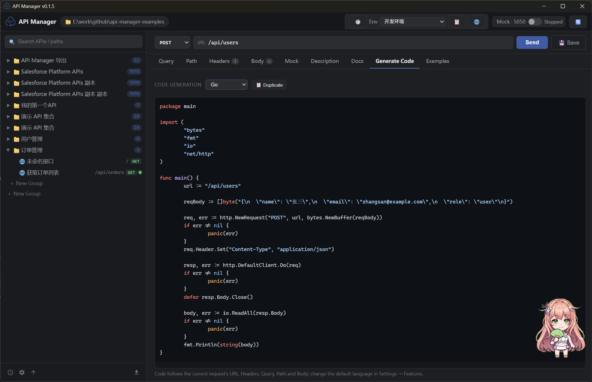 | 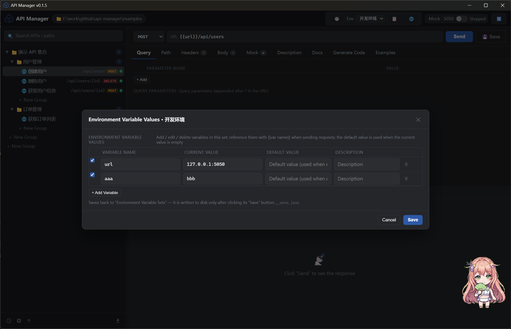 |
| 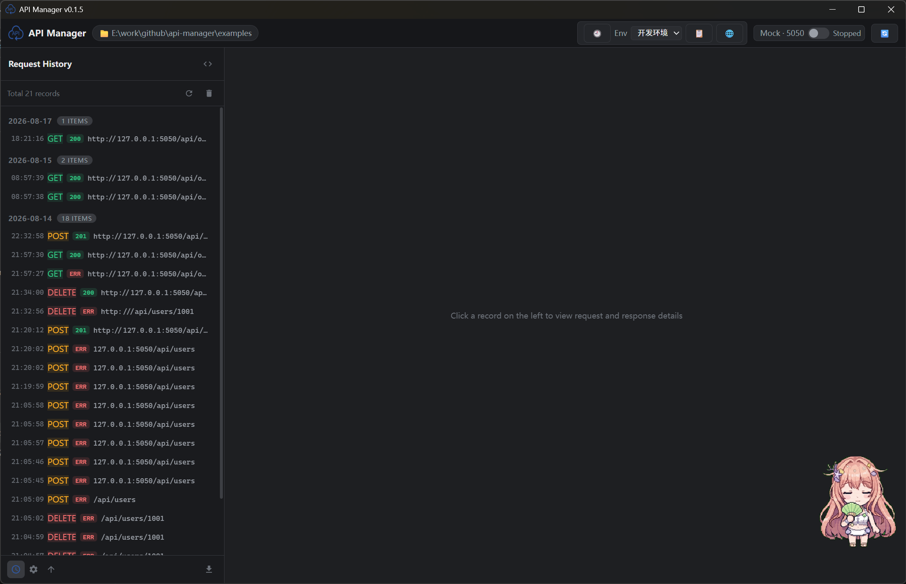 | 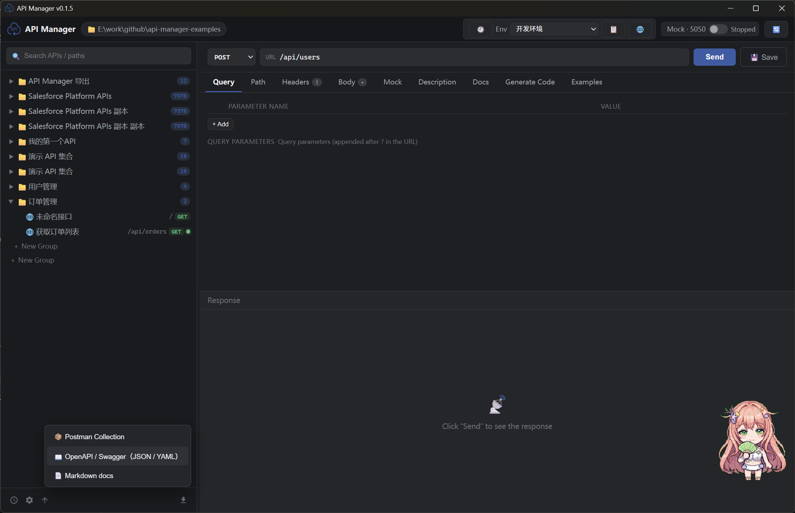 |
|  | 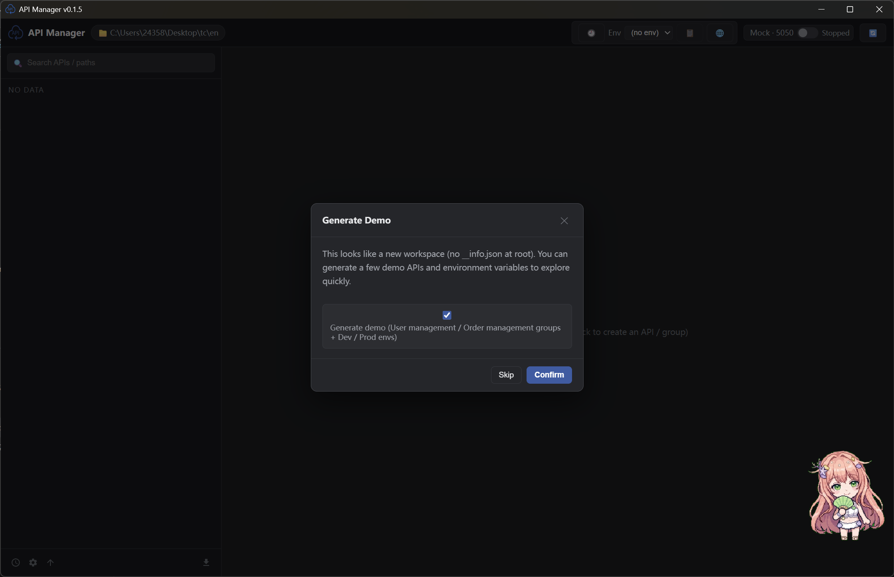 |
| 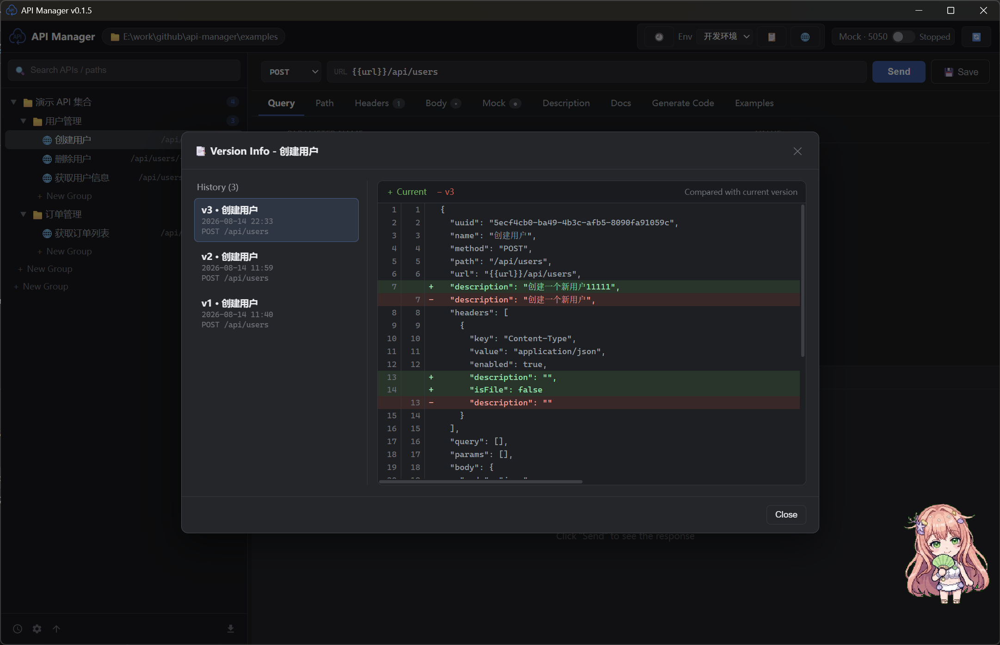 | 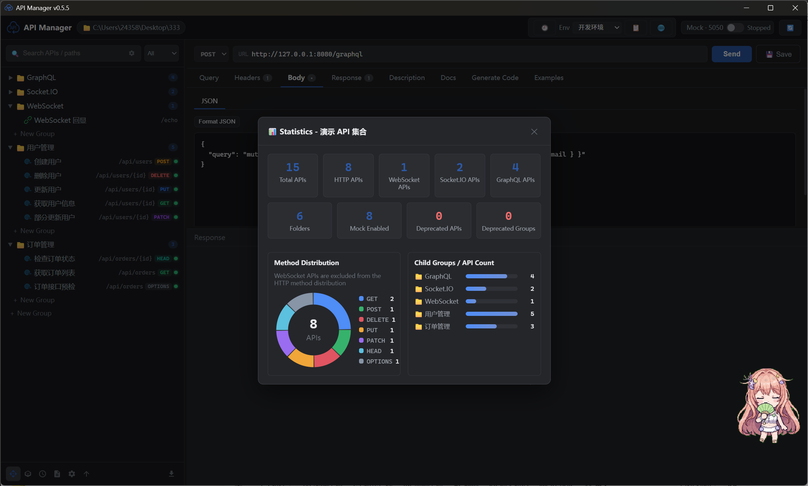 |
| 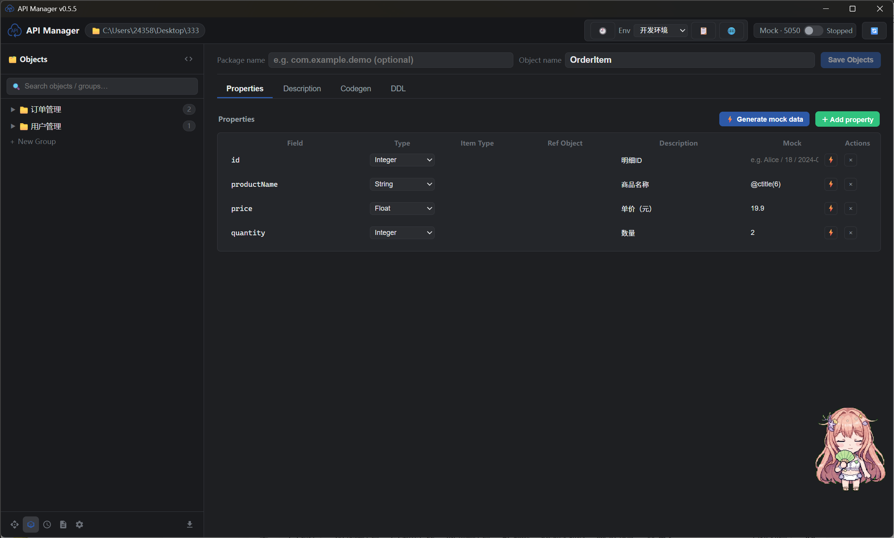 | 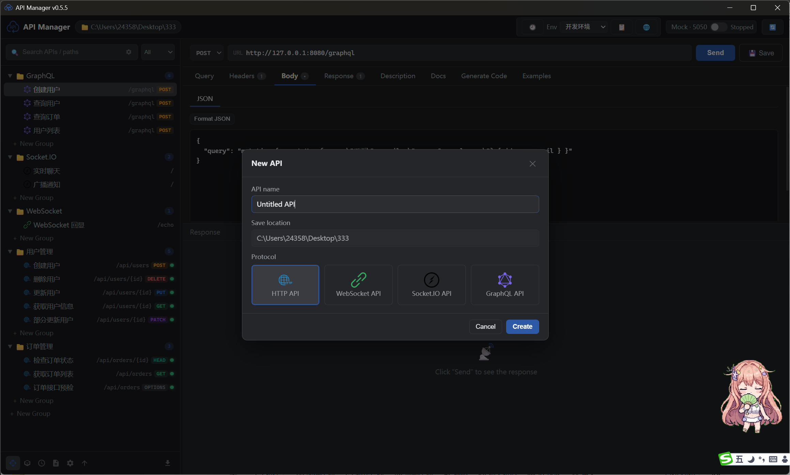 |
| 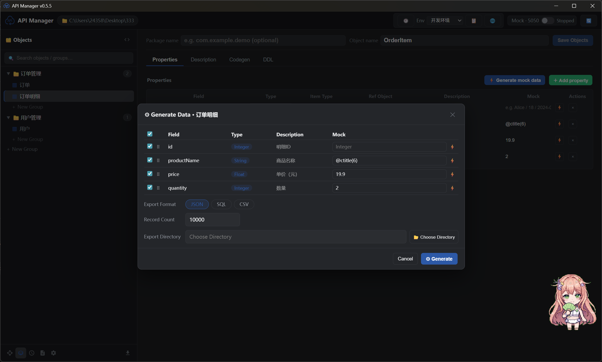 | 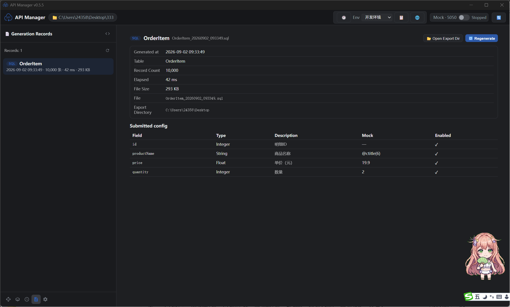 |
| 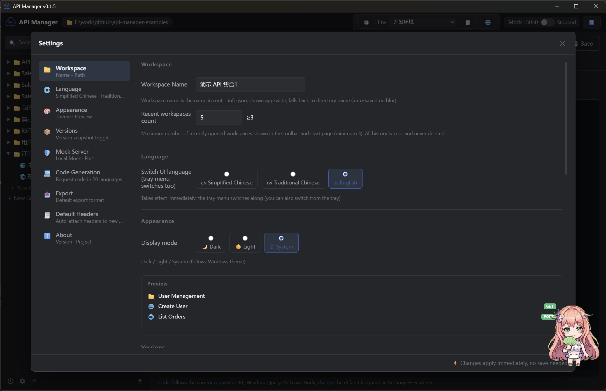 | |

## Features

- 📁 **Directories as collections**: pick a working directory when launching the app; its folder structure is your API collection structure
- 📄 **One API per JSON file**: API definitions, request parameters, and Mock data are all managed as JSON files — Git-friendly by nature
- 🧪 **Request testing**: send GET/POST/PUT/DELETE/PATCH requests; inspect status, latency, size, headers, and body (with JSON syntax highlighting)
- 🎭 **Mock server**: start a local Mock server with one click (default port 5050); automatically scans all APIs with Mock enabled; supports path parameters, delay, template variables, and global environment variables
- 📝 **API docs**: built-in documentation view that derives parameters (types, nested fields, descriptions) from request config and Mock bodies, with manual overrides; exportable as Markdown
- 📤 **One-click export**: export to Postman Collection, OpenAPI 3.0, or a Docsify documentation site
- 💻 **Code generation**: generate request code for 20+ languages / frameworks in one click (curl, JavaScript, Python, Java, Go, Rust, …)
- 🌐 **Global environment variables**: switch between multiple environments (dev / test / prod); `{{variable}}` placeholders are resolved in URL / Headers / Query / Body / Mock response
- 🖥️ **System tray**: closing the window minimizes to tray; tray menu can show/hide the window, start/stop the Mock server, check for updates, switch language (single submenu), or quit
- 🗂️ **Postman-style layout**: API tree on the left (search, groups, CRUD, duplicate), request editor in the middle, response panel below
- 🌐 Full support for **path params / Query / Headers / Body** (Body modes: raw / JSON / XML / form / binary file)
- 🧩 `{param}` path templates and template variables like `{{path.id}}`, `{{query.page}}`
- 📥 **Postman import**: import an entire Postman Collection with one click; collection-level `variable`s are merged into environment sets automatically
- 📦 **Object manager**: manage data structures as groups + objects; properties support type, referenced object, Mock value, and description; import from JSON or SQL `CREATE TABLE`; generate code in multiple languages and MySQL DDL in one click
- 🎲 **Data generation**: batch-generate test data from an object's properties (JSON / SQL / CSV) with a custom table name, record count, and export directory; logs record elapsed time and file size, and support one-click regeneration
- 🔌 **Multi-protocol APIs**: create APIs as HTTP / WebSocket / Socket.IO / GraphQL, all managed in one workspace
- ✏️ **Batch add / edit**: Query / Headers / Body (form) tabs support `key: value` batch editing, one per line, preserving enabled state

## Directory Conventions

```
workspace/
├── __info.json                  # root description (collection info)
│                                # fields: name, description, baseUrl, mockPort
├── __envs.json                  # global environment variables (optional)
│                                # fields: active, environments[{name, variables[]}]
├── user-management/             # group = directory
│   ├── __info.json              # group description: name, description, order
│   ├── get-user.json            # one API = one JSON file
│   └── create-user.json
└── order-management/
    ├── __info.json
    └── list-orders.json
```

### API JSON File Format

```json
{
  "name": "获取用户信息",
  "method": "GET",
  "path": "/api/users/{id}",
  "url": "",
  "description": "根据用户 ID 获取用户信息",
  "headers": [{ "key": "Authorization", "value": "Bearer xxx", "enabled": true, "description": "" }],
  "query": [{ "key": "page", "value": "1", "enabled": true, "description": "" }],
  "params": [{ "key": "id", "value": "1001", "enabled": true, "description": "用户 ID" }],
  "body": { "mode": "json", "raw": "{ ... }", "form": [] },
  "mock": {
    "enabled": true,
    "status": 200,
    "headers": [],
    "delay": 200,
    "body": "{ \"code\": 0, \"data\": { \"id\": \"{{path.id}}\" } }"
  },
  "examples": []
}
```

> When `url` is empty, the request URL = root `__info.json` `baseUrl` + `path`;
> when `url` is set, it takes priority.

### Mock Template Variables

- `{{path.id}}` — path parameter (matches `{id}` in path)
- `{{query.page}}` — Query parameter
- `{{method}}` — request method
- `{{path}}` — full path
- `{{variable}}` — global environment variable (from the active environment; `path` / `method` / `path.*` / `query.*` are reserved for system variables)

### Global Environment Variables

The **environment** dropdown in the toolbar switches the active environment; click 🌐 to open environment management, split into **two dialogs**:

**① Environment set management**: create full variable sets, reorder by **drag-and-drop**; **right-click** a set name to edit (rename) / duplicate / delete — multiple sets (e.g. dev / test / prod) can coexist.
**② Variable value management**: select a set, click "✏ 管理变量值" to add / edit / delete variables within it. Each variable has a **current value**, a **default value** (used automatically when the current value is empty), and a **description**.

- When sending requests, `{{variable}}` in URL / Headers / Query / Body is replaced with the active environment's value
- Mock response bodies support `{{variable}}` too (applied after starting/refreshing the Mock server)
- Configuration is stored in `__envs.json` at the workspace root and can be version-controlled with Git

Example: set `baseUrl` in `__info.json` to `{{baseUrl}}` and the request target changes when you switch environments.

> **Postman import**: when importing a Collection, the top-level `variable` array is merged by key into the environment set with the same name (created if missing, named after the collection; auto-activated if no environment is active) — no manual entry needed.

### System Tray

- Clicking the window close button hides the app to the tray (the app keeps running)
- Left-click the tray icon: show the window; right-click: menu
- Tray menu: show window / hide window / start·stop Mock server / check for updates / language (single submenu, check to switch) / quit
- The Mock menu item text updates with the Mock server status

## Development & Build

### Prerequisites

- Node.js ≥ 18
- Rust (Windows MSVC toolchain)
- WebView2 (bundled with Windows 10/11)
- [just](https://github.com/casey/just) (command runner)

### Common Commands (just)

```bash
just dev         # run in dev mode (frontend HMR + Rust dev)
just test        # run all tests (Rust unit tests + frontend type check + frontend build)
just build       # full package: exe + NSIS / MSI installer (optional)
just release     # build the standalone executable and collect it into ./release/ (no install needed)
just exe         # build only the release executable (fast)
just tsc         # frontend type check
just check       # Rust compile check
just icon        # regenerate app icons (ultramarine theme)
just clean       # clean build artifacts
just push "msg"  # commit and push to remote
just             # list all commands
```

> The justfile supports both Windows (cmd) and WSL (bash). If Chinese arguments look garbled on a Windows console, run `chcp 65001` first to switch to UTF-8.

### Build Artifacts

- `just release` output: `release/api-manager.exe` — a standalone executable; no installation needed, copy it to any Windows machine and run (Win10/11 ships the WebView2 runtime)
- `just build` (optional) output: `src-tauri/target/release/bundle/nsis/API Manager_0.1.6_x64-setup.exe` — NSIS installer; `bundle/msi/API Manager_0.1.6_x64_en-US.msi` — MSI

### Running Tests

```bash
just test
```

### Sample Workspace

`examples/demo-workspace/` provides a complete example with two groups: user management and order management.
Open the app and pick this directory to try every feature (built-in Mock is enabled).

## Tech Stack

- **Frontend**: React 18 + TypeScript + Vite 5
- **Backend**: Tauri 2 (Rust), Axum powers the Mock server, reqwest sends test requests
- **Theme color**: Ultramarine `#2E59A7`
- **Plugins**: `tauri-plugin-dialog` (directory picker)
