# API Manager

使用 **Tauri 2** 開發的 API 接口文檔、接口測試與 Mock 工具，界面佈局參考 Postman。

## 界面預覽

| | |
| --- | --- |
| 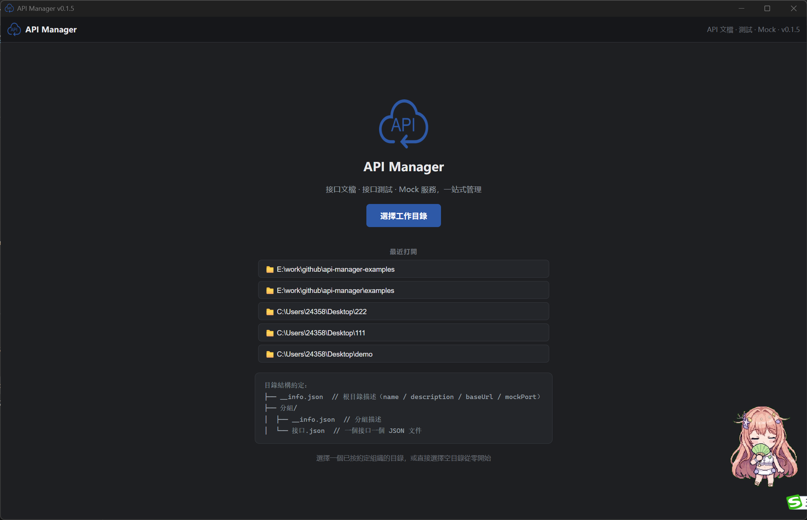 | 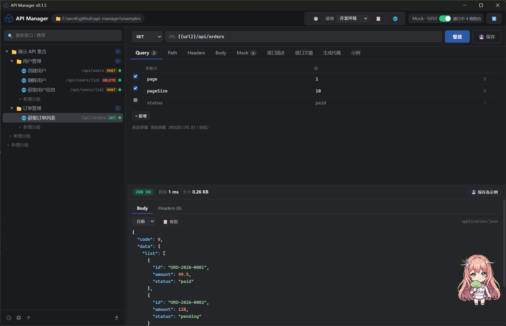 |
| 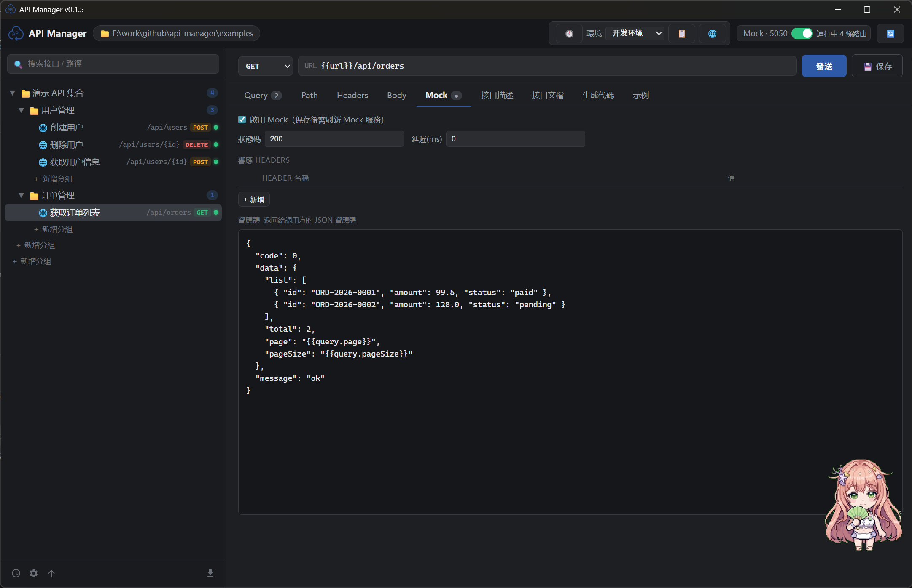 | 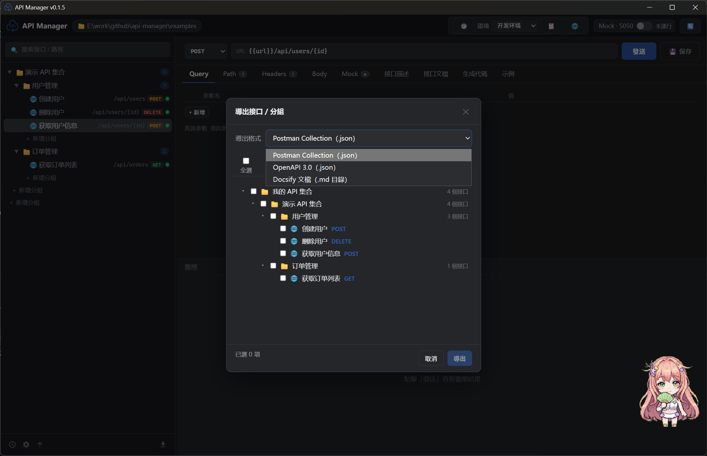 |
| 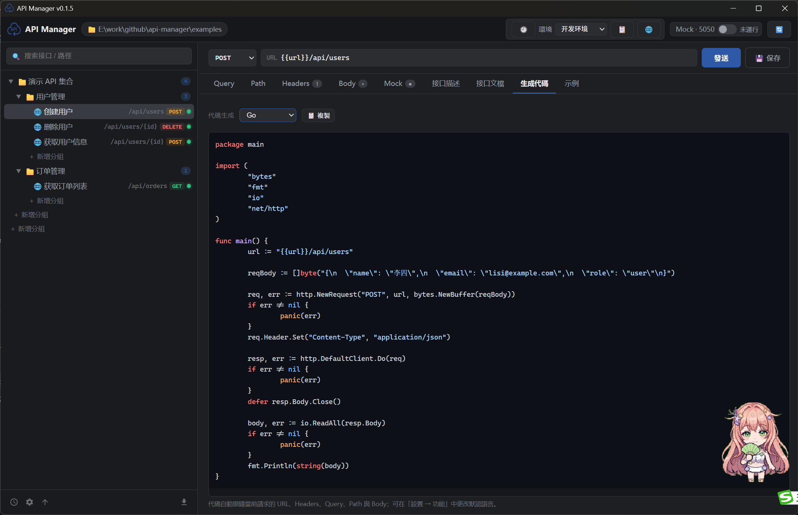 | 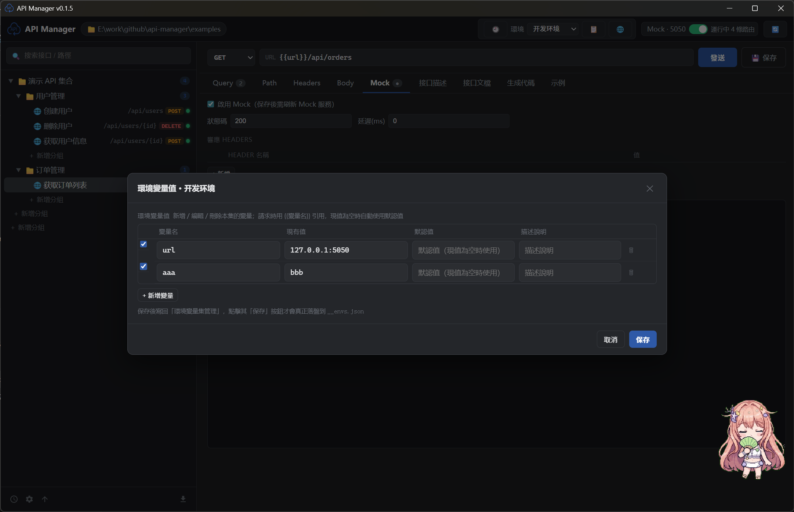 |
| 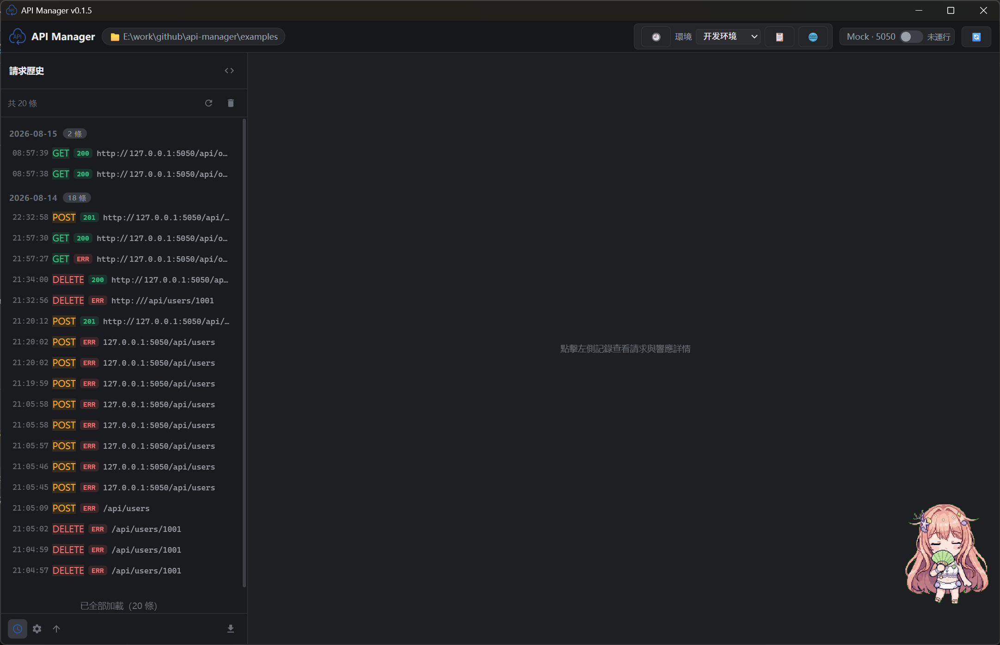 | 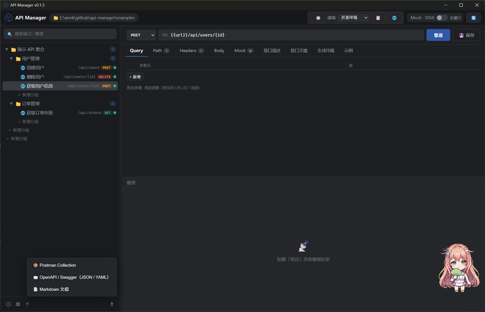 |
| 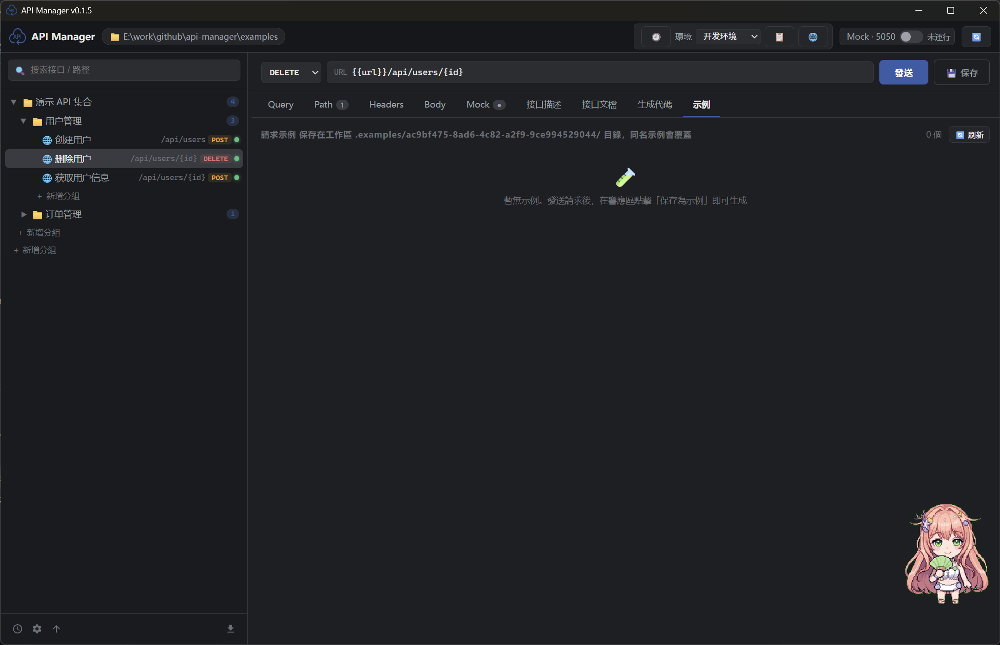 | 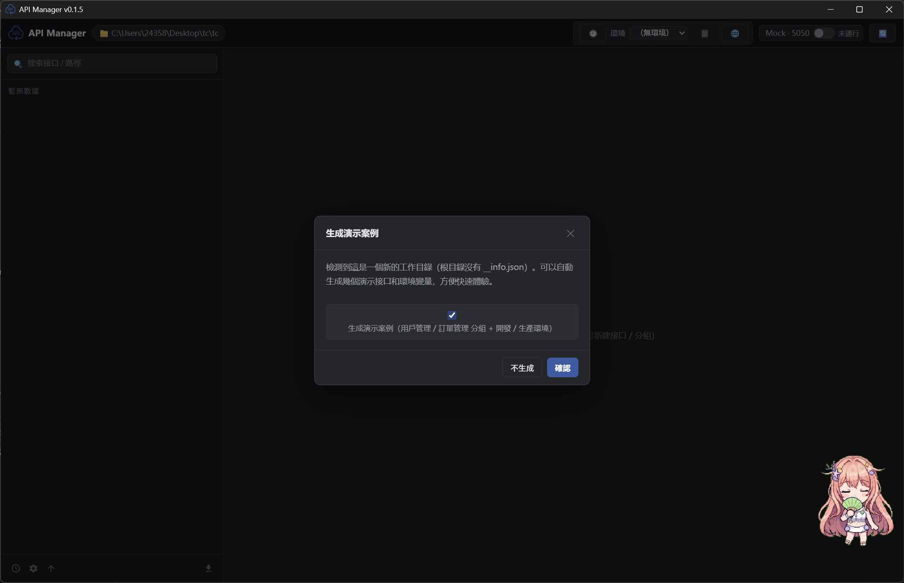 |
| 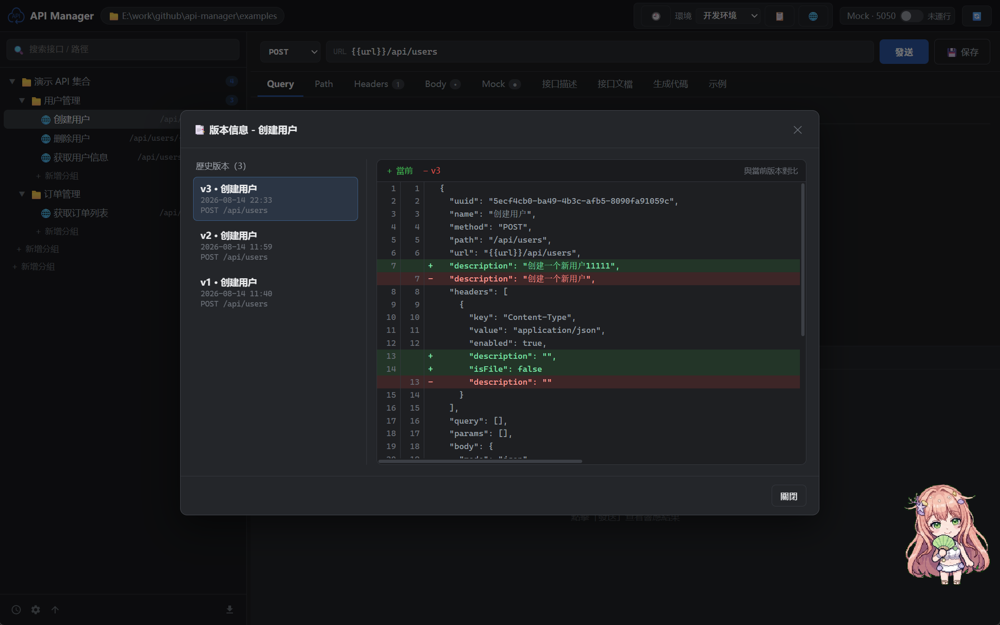 | 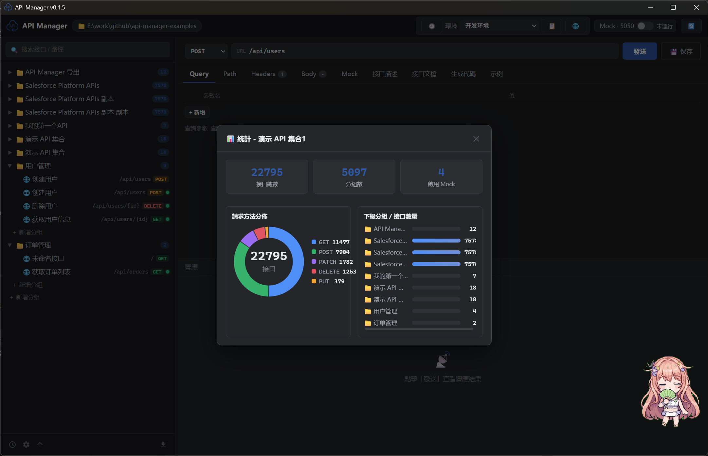 |
| 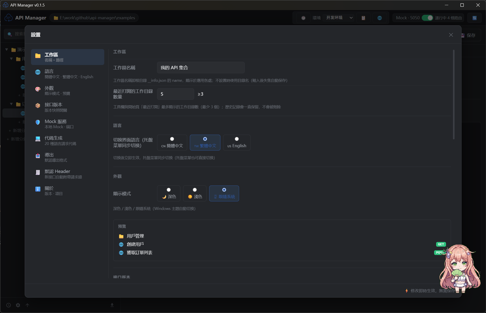 | |

## 功能特性

- 📁 **目錄即集合**：打開應用時選擇一個工作目錄，目錄結構即接口集合結構
- 📄 **一個接口一個 JSON 文件**：接口定義、請求參數、Mock 數據全部以 JSON 文件形式管理，天然支持 Git 版本管理
- 🧪 **接口測試**：發送 GET/POST/PUT/DELETE/PATCH 等請求，查看響應狀態、耗時、大小、Headers、Body（帶 JSON 語法高亮）
- 🎭 **Mock 服務**：一鍵啟動本地 Mock 服務（默認端口 5050），自動掃描所有啟用 Mock 的接口，支持路徑參數、延遲、模板變量、全局環境變量
- 📝 **接口文檔**：內置接口文檔頁，自動從請求配置與 Mock 響應體推導參數（類型、嵌套字段、說明），支持手動補充與修正；可導出 Markdown 文檔
- 📤 **一鍵匯出**：支持 Postman Collection / OpenAPI 3.0 / Docsify 文檔站點三種格式導出
- 💻 **代碼生成**：一鍵生成 20+ 種語言 / 框架的請求代碼（curl、JavaScript、Python、Java、Go、Rust 等）
- 🌐 **全局環境變量**：多環境配置（開發/測試/生產）一鍵切換，請求時 `{{變量名}}` 自動替換到 URL / Headers / Query / Body / Mock 響應體
- 🖥️ **系統托盤**：關閉窗口最小化到托盤，托盤菜單可顯示/隱藏窗口、快速啟停 Mock、切換語言、退出
- 🗂️ **Postman 風格佈局**：左側接口樹（支持搜索、分組、增刪改、複製）、中間請求編輯器、下方響應面板
- 🌐 **路徑參數 / Query / Headers / Body** 完整支持（Body 支持 raw / JSON / XML / 表單 / 二進制文件）
- 🧩 接口支持 `{參數名}` 路徑模板、模板變量 `{{path.id}}`、`{{query.page}}`
- 📥 **多格式導入**：支持 Postman Collection、OpenAPI (Swagger) 協議、Markdown 接口文檔一鍵導入；Postman 集合級 `variable` 自動合併到環境變量集

## 目錄結構約定

```
工作目錄/
├── __info.json                  # 根目錄描述（集合信息）
│                                # 字段：name, description, baseUrl, mockPort
├── __envs.json                  # 全局環境變量（可選）
│                                # 字段：active, environments[{name, variables[]}]
├── 用戶管理/                    # 分組 = 目錄
│   ├── __info.json              # 分組描述：name, description, order
│   ├── 獲取用戶信息.json         # 一個接口 = 一個 JSON 文件
│   └── 創建用戶.json
└── 訂單管理/
    ├── __info.json
    └── 獲取訂單列表.json
```

### 接口 JSON 文件格式

```json
{
  "name": "獲取用戶信息",
  "method": "GET",
  "path": "/api/users/{id}",
  "url": "",
  "description": "根據用戶 ID 獲取用戶信息",
  "headers": [{ "key": "Authorization", "value": "Bearer xxx", "enabled": true, "description": "" }],
  "query": [{ "key": "page", "value": "1", "enabled": true, "description": "" }],
  "params": [{ "key": "id", "value": "1001", "enabled": true, "description": "用戶 ID" }],
  "body": { "mode": "json", "raw": "{ ... }", "form": [] },
  "mock": {
    "enabled": true,
    "status": 200,
    "headers": [],
    "delay": 200,
    "body": "{ \"code\": 0, \"data\": { \"id\": \"{{path.id}}\" } }"
  },
  "examples": []
}
```

> `url` 為空時，請求地址 = 根 `__info.json` 的 `baseUrl` + `path`；
> 填寫 `url` 則優先使用完整地址。

### Mock 模板變量

- `{{path.id}}` — 路徑參數（對應 path 中的 `{id}`）
- `{{query.page}}` — Query 參數
- `{{method}}` — 請求方法
- `{{path}}` — 完整路徑
- `{{變量名}}` — 全局環境變量（來自激活環境，`path`/`method`/`path.*`/`query.*` 保留給系統變量）

### 全局環境變量

工具欄的**環境**下拉框可快速切換當前環境；點擊 🌐 進入環境變量管理，分**兩個彈出框**：

**① 環境變量集管理**：新增整套變量配置，支持**拖動排序**；**右鍵**集名稱彈出菜單可 編輯（重命名）/ 複製 / 刪除，多套配置（如 開發 / 測試 / 生產）並存；
**② 環境變量值管理**：選中具體的環境變量集後，點擊「✏ 管理變量值」打開，維護該集合內的變量（新增 / 編輯 / 刪除）。每個變量包含**現有值**、**默認值**（現值為空時自動使用）和**描述說明**。

- 請求發送時，URL / Headers / Query / Body 中的 `{{變量名}}` 會被替換為激活環境的值
- Mock 響應體同樣支持 `{{變量名}}`（啟動/刷新 Mock 後生效）
- 配置保存在工作區根目錄 `__envs.json`，可納入 Git 管理

示例：`__info.json` 的 `baseUrl` 可設為 `{{baseUrl}}`，在不同環境間切換時請求目標隨之變化。

> **Postman 導入**：導入 Collection 時，文件頂層的 `variable` 數組會按 key 合併到同名環境變量集（不存在則新建，命名同集合名；無激活環境時自動激活），無需手動逐個錄入。

### 系統托盤

- 點擊窗口關閉按鈕：隱藏到托盤（應用繼續運行）
- 托盤圖標左鍵單擊：顯示窗口；右鍵：菜單
- 托盤菜單：顯示窗口 / 隱藏窗口 / 啟動·停止 Mock 服務 / 檢查更新 / 語言（單行子菜單，勾選切換）/ 退出
- 托盤菜單中的 Mock 項文字會隨 Mock 服務狀態自動更新

## 開發與構建

### 環境要求

- Node.js ≥ 18
- Rust（Windows MSVC 工具鏈）
- WebView2（Windows 10/11 自帶）
- [just](https://github.com/casey/just)（命令運行器）

### 常用命令（just）

```bash
just dev         # 開發模式運行（前端熱更新 + Rust dev）
just test        # 運行全部測試（Rust 單測 + 前端類型檢查 + 前端構建）
just build       # 完整打包：exe + NSIS / MSI 安裝程序（可選）
just release     # 僅生成單體可執行文件並收集到 ./release/（無需安裝，拷走即用）
just exe         # 僅構建 release 可執行文件（快速，release 的構建部分）
just tsc         # 前端類型檢查
just check       # Rust 編譯檢查
just icon        # 重新生成應用圖標（群青主題）
just clean       # 清理構建產物
just push "信息" # 提交並推送到遠程
just             # 列出全部命令
```

> justfile 同時支持 Windows（cmd）與 WSL（bash）環境；Windows 命令行下中文參數亂碼時，可先執行 `chcp 65001` 切換 UTF-8 代碼頁。

### 構建產物

- `just release` 產物：`release/api-manager.exe` — 單體可執行文件，無需安裝，拷到任意 Windows 機器直接運行（Win10/11 自帶 WebView2 運行時）
- `just build`（可選）產物：`src-tauri/target/release/bundle/nsis/API Manager_0.1.5_x64-setup.exe` — NSIS 安裝包；`bundle/msi/API Manager_0.1.5_x64_en-US.msi` — MSI

### 運行測試

```bash
just test
```

### 示例工作區

`examples/demo-workspace/` 提供了一個完整示例，包含用戶管理、訂單管理兩個分組。
啟動應用後選擇該目錄即可體驗全部功能（內置 Mock 已啟用）。

## 技術棧

- **前端**：React 18 + TypeScript + Vite 5
- **後端**：Tauri 2（Rust），Axum 提供 Mock 服務，reqwest 發送測試請求
- **主題色**：群青 `#2E59A7`
- **插件**：`tauri-plugin-dialog`（目錄選擇）
