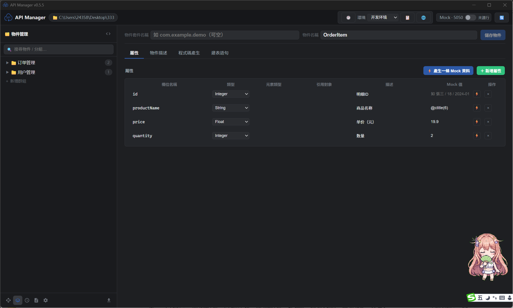
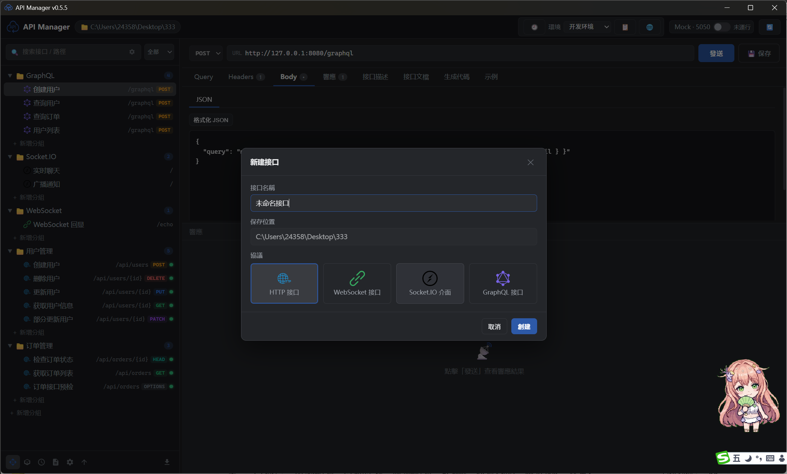
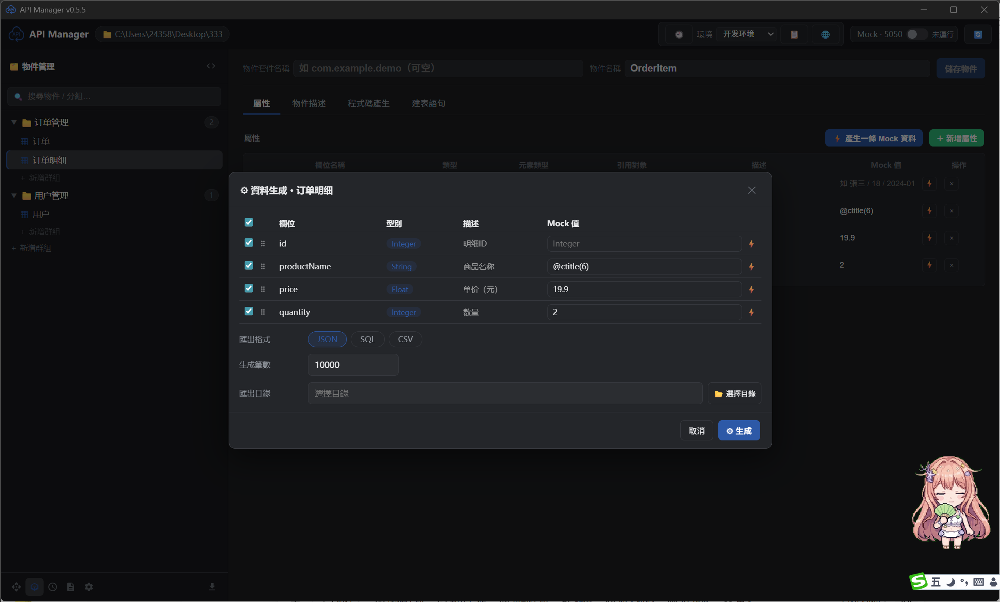
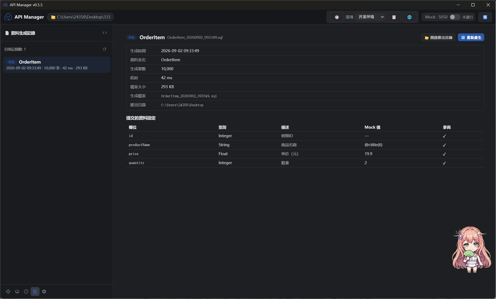

# API Manager

[English](README.md) · [简体中文](README.cn.md) · **繁體中文**

[](https://github.com/freewu/api-manager/releases)
[](LICENSE)
[](https://github.com/freewu/api-manager/releases)
[](#下載)

[](https://tauri.app)
[](https://www.rust-lang.org)
[](https://react.dev)
[](https://www.typescriptlang.org)
[](https://vitejs.dev)

使用 **Tauri 2**（Rust + React）開發的 API 接口文檔、接口測試與 Mock 工具，界面佈局參考 Postman。**目錄即集合、一個接口一個 JSON 文件**，接口定義可以隨代碼一起提交到 Git，便於評審、追溯與團隊協作。

> 🌍 三語界面（简体中文 / 繁體中文 / English） · 🖥️ Windows / macOS / Linux · 📦 開源免費（MIT）

## 界面預覽

| | |
| --- | --- |
|  |  |
|  |  |
|  |  |
|  |  |
|  |  |
|  |  |
|  |  |
|  |  |
|  | |

## 功能特性

### 🗂️ 工作區與集合

- 📁 **目錄即集合**：打開應用時選擇一個工作目錄，目錄結構就是接口集合結構，一個分組對應一個目錄
- 📄 **一個接口一個 JSON 文件**：接口定義、請求參數、Mock 數據與請求示例全部以 JSON 文件形式管理，天然支持 Git 版本管理
- 🕘 **版本管理**：每個接口可保存多個版本快照，支持左右對比差異，隨時回退到任意歷史版本
- 🔀 **版本控制集成**：自動識別工作區中的 `.git` / `.svn`，標題欄提供一鍵**同步**與**提交並 Push**（遠程配置見 *設置 → 同步遠程*）
- 🔍 **搜索與高級搜索**：按名稱 / 路徑快速搜索接口，也可按接口類型與 Method 過濾
- ⭐ **收藏**：接口右鍵選擇「收藏」即可加入收藏視圖，支持拖動排序，並擁有獨立的編輯面板

### 🧪 接口測試

- 🧪 **發送請求**：支持 GET / POST / PUT / DELETE / PATCH / HEAD / OPTIONS，查看狀態碼、耗時、大小、Headers 與 Body，JSON 語法高亮、JSON / XML 一鍵格式化
- 🌐 **路徑參數 / Query / Headers / Body** 完整支持（Body 支持 raw / JSON / XML / 表單 / **二進制文件**）
- 🧩 **模板變量**：接口支持 `{參數名}` 路徑模板，以及 `{{path.id}}`、`{{query.page}}`、`{{method}}`、`{{path}}`、`{{變量名}}`，在 URL / Headers / Query / Body / Mock 響應中自動替換
- 🕘 **請求歷史**：自動記錄每一次請求，一鍵再次發送或回填到編輯器
- 📋 **請求示例**：把請求 + 響應保存為命名示例，可一鍵應用到當前接口，也可把某個接口的全部示例導出為 `.http` 文件
- ✏️ **批量添加編輯**：Query / Headers / Body（表單）頁籤支持 `key: value` 每行一條的批量編輯，保存後匹配行保留啟用狀態

### 🔌 多協議接口

- 🔌 新建接口支持 **HTTP / WebSocket / Socket.IO / GraphQL / WebDAV / MCP / TCP / UDP**，一套工作區、一棵接口樹、一份歷史記錄統一管理
- 🔁 **WebSocket / Socket.IO**：連接後實時收發消息，並在響應區查看幀 / 事件日誌
- 🧮 **GraphQL**：查詢語句 + 變量編輯器
- 🗂️ **WebDAV**：在標準 HTTP 方法之外提供 `PROPFIND` / `PROPPATCH` / `MKCOL` / `COPY` / `MOVE` / `LOCK` / `UNLOCK` / `REPORT` 等 WebDAV 方法
- 🤖 **MCP**：以 HTTP 方式調用 MCP 端點，複用同一套請求編輯器與響應查看器
- 📦 **TCP / UDP**：報文編輯器自定義字段（名稱 / 類型 / 長度 / 值），並內置報文解析查看器

### 🎭 Mock 服務

- 🎭 **一鍵啟動本地 Mock 服務**（默認端口 5050）：自動掃描所有啟用 Mock 的接口並對外提供本地服務
- ⚙️ **按接口配置**：狀態碼、響應 Header、延遲時間與模板響應體
- 🧩 **模板支持**：按請求實時替換 `{{path.id}}` / `{{query.page}}` / `{{method}}` / `{{path}}` 與全局 `{{變量名}}`
- 🚀 **無需後端**：真實接口就緒前，前端開發即可並行推進

### 📝 接口文檔、導入與導出

- 📝 **接口文檔**：內置接口文檔頁，自動從請求配置與 Mock 響應體推導參數（類型、嵌套字段、說明），支持手動補充與修正，可導出 Markdown 文檔
- ✍️ **Markdown 接口描述編輯器（Vditor）**：接口「描述」頁籤是完整的 Markdown 編輯器，支持所見即所得與高亮只讀預覽；**Vditor 全部資源已本地化打包，完全離線可用**
- 🏷️ **apiDoc 註釋**：查看接口的 apiDoc 註釋，並支持工作區內 Markdown 文檔預覽
- 📤 **一鍵導出（28 種格式）**：Postman Collection、**OpenAPI 3.0（JSON 與 YAML，默認 YAML）**、Apifox、Apipost、Apizza、Bruno、Insomnia、Hoppscotch、YApi、Eolink、NEI、Doclever、EasyDoc、Docway、io-docs、MeterSphere、Rap2、JMeter、apiDoc、Apidog、RAML、WADL、HAR，以及文檔站點（Docsify / MkDocs / Markdown / HTML）
- 📥 **多格式導入（26 種格式）**：Postman Collection、OpenAPI / Swagger（JSON 與 YAML）、Markdown、Apifox、Apipost、cURL 等；導入菜單展示哪些入口可在 *設置 → 導入* 中配置
- 🔄 **集合變量自動遷移**：導入 Postman Collection 時，文件頂層的 `variable` 數組會按 key 合併到同名環境變量集

### 📦 對象管理與數據生成

- 📦 **對象管理**：以分組 + 對象的方式管理數據結構；屬性支持類型 / 引用對象 / Mock 值 / 描述配置；支持從 JSON 或 SQL 建表語句導入；一鍵生成多語言代碼與 MySQL 建表語句
- 🎲 **數據生成**：按對象屬性批量生成測試數據（JSON / SQL / CSV），自定義表名、記錄數與導出目錄
- 🧾 **生成記錄**：每次生成記錄耗時與文件大小，可一鍵重新生成
- 🧬 **代碼生成**：一鍵生成 20+ 種語言 / 框架的請求代碼（curl、JavaScript、Python、Java、Go、Rust 等）

### ⚙️ 效率與外觀

- 🌐 **全局環境變量**：開發 / 測試 / 生產多環境一鍵切換，`{{變量名}}` 自動替換到 URL / Headers / Query / Body / Mock 響應（詳見[全局環境變量](#全局環境變量)）
- ⌨️ **全局快捷鍵**：9 個可自定義快捷鍵，覆蓋視圖切換、導入導出、設置與環境管理（詳見[快捷鍵](#快捷鍵)），在 *設置 → 快捷鍵* 中錄製新按鍵
- 🗂️ **Postman 風格佈局**：左側接口樹（搜索、分組、增刪改、複製）、中間請求編輯器、下方響應面板，各面板可拖動調整
- 📊 **統計**：分組 / 工作區維度統計接口數、Mock 啟用數與請求方法分佈
- 🖥️ **系統托盤**：關閉窗口最小化到托盤，托盤菜單可顯示 / 隱藏窗口、啟停 Mock、切換顯示模式與語言、檢查更新、退出
- 🔔 **檢查更新**：啟動時自動檢查 GitHub Releases，發現新版本彈窗提醒並可一鍵跳轉下載
- ℹ️ **關於頁籤**：*設置 → 關於* 匯總展示應用依賴的全部開源組件（名稱、版本、跳轉鏈接）
- 🎨 **主題**：深色 / 淺色 / 跟隨系統，切換即時生效
- 🌍 **三語界面**：简体中文 / 繁體中文 / English，隨時切換

## 下載

所有安裝包由 GitHub Actions 在每次發佈時構建，並發佈到 [Releases](https://github.com/freewu/api-manager/releases) 頁面。

| 平台 | 安裝包 |
| --- | --- |
| Windows | `API.Manager_1.0.0_x64-setup.exe`（NSIS）· `API.Manager_1.0.0_x64_en-US.msi` · `API.Manager_1.0.0_x64_portable.exe`（免安裝單體版） |
| macOS | `API.Manager_1.0.0_x64.dmg`（Intel）· `API.Manager_1.0.0_aarch64.dmg`（Apple Silicon） |
| Linux | `API.Manager_1.0.0_amd64.AppImage` · `API.Manager_1.0.0_amd64.deb` · `API.Manager-1.0.0-1.x86_64.rpm` |

> Windows 下也可以自行構建單體可執行文件 `api-manager.exe`，見[開發與構建](#開發與構建)。

## 快捷鍵

默認快捷鍵（均可自定義，在 *設置 → 快捷鍵* 中修改；macOS 請將 <kbd>Ctrl</kbd> 視為 <kbd>Cmd</kbd>）：

| 快捷鍵 | 功能 |
| --- | --- |
| <kbd>Ctrl</kbd>+<kbd>A</kbd> | 切換到**接口管理**界面 |
| <kbd>Ctrl</kbd>+<kbd>O</kbd> | 切換到**對象管理**界面 |
| <kbd>Ctrl</kbd>+<kbd>H</kbd> | 切換到**請求歷史**界面 |
| <kbd>Ctrl</kbd>+<kbd>G</kbd> | 切換到**數據生成記錄**界面 |
| <kbd>Ctrl</kbd>+<kbd>F</kbd> | 切換到**收藏**界面 |
| <kbd>Ctrl</kbd>+<kbd>E</kbd> | 打開**導出**彈窗（會先切到接口管理界面） |
| <kbd>Ctrl</kbd>+<kbd>I</kbd> | 打開**導入**菜單（會先切到接口管理界面） |
| <kbd>Ctrl</kbd>+<kbd>S</kbd> | 打開**設置**彈窗（再次按下關閉） |
| <kbd>Ctrl</kbd>+<kbd>M</kbd> | 打開**環境管理**彈窗（再次按下關閉） |

- 在輸入框 / 文本域 / 可編輯區域中按鍵不會觸發快捷鍵；彈窗打開時快捷鍵不會切換背後的視圖
- 錄製新快捷鍵：*設置 → 快捷鍵* 中點擊某一行的按鍵按鈕後按下組合鍵；<kbd>Esc</kbd> 取消錄製，<kbd>Backspace</kbd> / <kbd>Delete</kbd> 清除綁定，`↺` 恢復單行默認值，**全部恢復默認**一鍵重置
- 存在衝突的綁定會顯示 ⚠ 標記，觸發時以定義順序中第一個匹配的動作為準

## 目錄結構約定

```
工作目錄/
├── __info.json                  # 根目錄描述（集合信息）
│                                # 字段：name, description, baseUrl, mockPort
├── __envs.json                  # 全局環境變量（可選）
│                                # 字段：active, environments[{name, variables[]}]
├── 用戶管理/                    # 分組 = 目錄
│   ├── __info.json              # 分組描述：name, description, order
│   ├── 獲取用戶信息.json         # 一個接口 = 一個 JSON 文件
│   └── 創建用戶.json
└── 訂單管理/
    ├── __info.json
    └── 獲取訂單列表.json
```

### 接口 JSON 文件格式

```json
{
  "name": "獲取用戶信息",
  "method": "GET",
  "path": "/api/users/{id}",
  "url": "",
  "description": "根據用戶 ID 獲取用戶信息",
  "headers": [{ "key": "Authorization", "value": "Bearer xxx", "enabled": true, "description": "" }],
  "query": [{ "key": "page", "value": "1", "enabled": true, "description": "" }],
  "params": [{ "key": "id", "value": "1001", "enabled": true, "description": "用戶 ID" }],
  "body": { "mode": "json", "raw": "{ ... }", "form": [] },
  "mock": {
    "enabled": true,
    "status": 200,
    "headers": [],
    "delay": 200,
    "body": "{ \"code\": 0, \"data\": { \"id\": \"{{path.id}}\" } }"
  },
  "examples": []
}
```

> `url` 為空時，請求地址 = 根 `__info.json` 的 `baseUrl` + `path`；
> 填寫 `url` 則優先使用完整地址。

### Mock 模板變量

- `{{path.id}}` — 路徑參數（對應 path 中的 `{id}`）
- `{{query.page}}` — Query 參數
- `{{method}}` — 請求方法
- `{{path}}` — 完整路徑
- `{{變量名}}` — 全局環境變量（來自激活環境，`path`/`method`/`path.*`/`query.*` 保留給系統變量）

### 全局環境變量

工具欄的**環境**下拉框可快速切換當前環境；點擊 🌐 進入環境變量管理，分**兩個彈出框**：

**① 環境變量集管理**：新增整套變量配置，支持**拖動排序**；**右鍵**集名稱彈出菜單可 編輯（重命名）/ 複製 / 刪除，多套配置（如 開發 / 測試 / 生產）並存；
**② 環境變量值管理**：選中具體的環境變量集後，點擊「✏ 管理變量值」打開，維護該集合內的變量（新增 / 編輯 / 刪除）。每個變量包含**現有值**、**默認值**（現值為空時自動使用）和**描述說明**。

- 請求發送時，URL / Headers / Query / Body 中的 `{{變量名}}` 會被替換為激活環境的值
- Mock 響應體同樣支持 `{{變量名}}`（啟動/刷新 Mock 後生效）
- 配置保存在工作區根目錄 `__envs.json`，可納入 Git 管理

示例：`__info.json` 的 `baseUrl` 可設為 `{{baseUrl}}`，在不同環境間切換時請求目標隨之變化。

> **Postman 導入**：導入 Collection 時，文件頂層的 `variable` 數組會按 key 合併到同名環境變量集（不存在則新建，命名同集合名；無激活環境時自動激活），無需手動逐個錄入。

## 設置一覽

*設置*（<kbd>Ctrl</kbd>+<kbd>S</kbd>）共 12 個頁籤：

| 頁籤 | 配置內容 |
| --- | --- |
| 📁 工作區 | 工作區名稱與路徑 |
| 🌐 語言 | 简体中文 / 繁體中文 / English |
| 🎨 外觀 | 深色 / 淺色 / 跟隨系統，面板預覽 |
| 📦 接口版本 | 版本快照開關 |
| 🛡️ Mock 服務 | 本地 Mock 開關與端口 |
| 💻 代碼生成 | 請求代碼的默認生成語言 |
| 📤 導出 | 默認導出格式，以及導出彈窗中展示的格式 |
| 📥 導入 | 導入菜單中展示的格式 |
| 🧾 默認 Header | 新建接口自動附帶的請求頭 |
| ⌨️ 快捷鍵 | 錄製 / 重置全局快捷鍵 |
| 🔄 同步遠程 | Git / SVN 遠程同步配置 |
| ℹ️ 關於 | 應用版本、項目鏈接與開源組件清單 |

## 系統托盤

- 點擊窗口關閉按鈕：隱藏到托盤（應用繼續運行）
- 托盤圖標左鍵單擊：顯示窗口；右鍵：菜單
- 托盤菜單：顯示窗口 / 隱藏窗口 / 啟動·停止 Mock 服務 / 檢查更新 / 顯示模式 / 語言（單行子菜單，勾選切換）/ 退出
- 托盤菜單中的 Mock 項文字會隨 Mock 服務狀態自動更新

## 開發與構建

### 環境要求

- Node.js ≥ 18
- Rust（Windows MSVC 工具鏈）
- WebView2（Windows 10/11 自帶）
- [just](https://github.com/casey/just)（命令運行器）

### 常用命令（just）

```bash
just dev         # 開發模式運行（前端熱更新 + Rust dev）
just test        # 運行全部測試（Rust 單測 + 前端類型檢查 + 前端構建）
just build       # 完整打包：exe + NSIS / MSI 安裝程序（可選）
just release     # 僅生成單體可執行文件並收集到 ./release/（無需安裝，拷走即用）
just exe         # 僅構建 release 可執行文件（快速，release 的構建部分）
just tsc         # 前端類型檢查
just check       # Rust 編譯檢查
just icon        # 重新生成應用圖標（群青主題）
just clean       # 清理構建產物
just push "信息" # 提交並推送到遠程
just             # 列出全部命令
```

> justfile 同時支持 Windows（cmd）與 WSL（bash）環境；Windows 命令行下中文參數亂碼時，可先執行 `chcp 65001` 切換 UTF-8 代碼頁。

### 構建產物

- `just release` 產物：`release/api-manager.exe` — 單體可執行文件，無需安裝，拷到任意 Windows 機器直接運行（Win10/11 自帶 WebView2 運行時）
- `just build`（可選）產物：`src-tauri/target/release/bundle/nsis/API Manager_1.0.0_x64-setup.exe` — NSIS 安裝包；`bundle/msi/API Manager_1.0.0_x64_en-US.msi` — MSI

### 運行測試

```bash
just test
```

### 示例工作區

`examples/demo-workspace/` 提供了一個完整示例，包含用戶管理、訂單管理兩個分組。
啟動應用後選擇該目錄即可體驗全部功能（內置 Mock 已啟用）。

## 技術棧

| 層次 | 技術棧 |
| --- | --- |
| 桌面外殼 | [](https://tauri.app) [](https://www.rust-lang.org) |
| 前端 | [](https://react.dev) [](https://www.typescriptlang.org) [](https://vitejs.dev) |
| 後端（Rust） | [](https://github.com/tokio-rs/axum) [](https://github.com/seanmonstar/reqwest) [](https://tokio.rs) [](https://github.com/tower-rs/tower-http) |
| 數據與協議 | [](https://serde.rs) [](https://github.com/serde-rs/json) [](https://github.com/dtolnay/serde-yaml) [](https://github.com/RazrFalcon/roxmltree) [](https://socket.io) |
| 編輯器與高亮 | [](https://b3log.org/vditor/) [](https://highlightjs.org) |
| 工具鏈 | [](https://just.systems) [](https://tauri.app) [](https://github.com/tauri-apps/plugins-workspace) [](https://github.com/tauri-apps/plugins-workspace) |

- **主題色**：群青 `#2E59A7`
- 應用內「設置 → 關於」也會列出全部依賴及其聲明版本

## 開源許可

[MIT](LICENSE) © bluefrog
